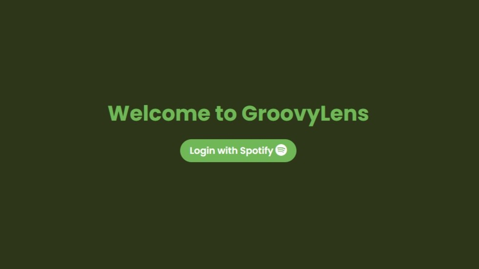

# GroovyLens



GroovyLens is a Flask web application that interacts with the Spotify API to provide users with insights into their Spotify account. Users can log in with their Spotify credentials to view their profile, playlists, top artists, and top tracks. The application is modularized using Flask blueprints for better organization and scalability.

## Table of Contents

- [GroovyLens](#groovylens)
  - [Table of Contents](#table-of-contents)
  - [Features](#features)
  - [Requirements](#requirements)
  - [Installation](#installation)
    - [Install the required packages](#install-the-required-packages)
    - [Configuration](#configuration)
    - [Usage](#usage)
  - [Documentation](#documentation)
    - [Routes](#routes)
    - [Project Structure](#project-structure)
    - [Files](#files)
  - [Author](#author)

## Features

- User authentication via Spotify OAuth
- Display user profile information
- Retrieve and display user playlists
- Retrieve and display user top artists and tracks
- Token refresh functionality
- Modular code organization using Flask blueprints

## Requirements

- Python 3.8+
- Flask
- Requests
- Spotify Developer Account

## Installation

Clone the repository:

```sh
git clone https://github.com/s-maarouf/GroovyLens.git
cd GroovyLens
```

### Install the required packages

```sh
sudo apt update && sudo apt upgrade -y
pip3 install -r requirements.txt
```

### Configuration

Create a Spotify Developer application at the Spotify Developer Dashboard.

Modify the config.py file with your Spotify Developer application credentials:

```python
ClientId = 'your_client_id'
ClientSecret = 'your_client_secret'
RedirectUri = 'your_redirect_uri'
```

### Usage

Run the application:
> Make sure that the 10000 port is open on your machine.

```sh
python3 app.py
```

Navigate to [localhost](http://localhost:10000) in your web browser to view the application.

## Documentation

### Routes

The application has the following routes:

- / - Home page
- /login - Login with Spotify
- /callback - Spotify OAuth callback
- /profile - User profile information
- /playlists - User playlists
- /top-artists - User top artists
- /top-tracks - User top tracks
- /logout - Logout

### Project Structure

```sh
GroovyLens/
├── app.py
├── config.py
├── requirements.txt
├── routes/
│   ├── __init__.py
│   ├── auth.py
│   ├── profile.py
│   ├── playlists.py
│   ├── top_items.py
│   ├── token.py
│   └── misc.py
├── templates/
│   ├── error.html
│   ├── forbidden.html
│   ├── index.html
│   ├── notfound.html
│   ├── playlists.html
│   ├── profile.html
│   ├── top_artists.html
│   └── top_tracks.html
└── static/
    ├── images/
    │   ├── home.png
    │   ├── profile.png
    │   └── spotify.png
    └── styles/
        ├── error.css
        ├── items.css
        ├── profile.css
        └── style.css
```

### Files

- app.py - Main application file
- config.py - Configuration file
- requirements.txt - Required packages
- routes/ - Contains route files
- templates/ - Contains HTML templates
- static/ - Contains static files

## Author

👤 **Author**

- GitHub: [@s-maarouf](https://github.com/s-maarouf)
